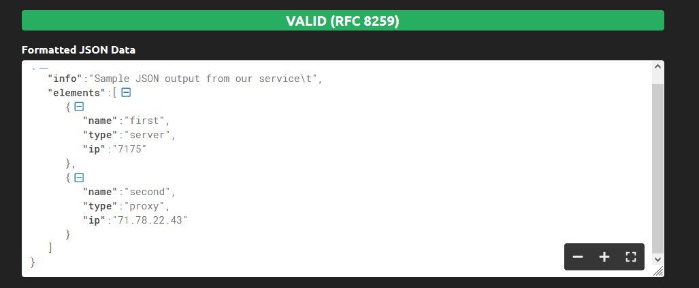

# 04-script-03-yaml

## Обязательная задача 1
Мы выгрузили JSON, который получили через API запрос к нашему сервису:
```
    { "info" : "Sample JSON output from our service\t",
        "elements" :[
            { "name" : "first",
            "type" : "server",
            "ip" : 7175 
            }
            { "name" : "second",
            "type" : "proxy",
            "ip : 71.78.22.43
            }
        ]
    }
```
  Нужно найти и исправить все ошибки, которые допускает наш сервис
```
    { "info" : "Sample JSON output from our service\t",
        "elements" :[
            { "name" : "first",
            "type" : "server",
            "ip" : "7175"    # Добавил кавычки в значение
            },  # Добавил запятую
            { "name" : "second",
            "type" : "proxy",
            "ip" : "71.78.22.43" # Добавил кавычки в ключ и значение
            }
        ]
    }
```
Валидатор https://jsonformatter.curiousconcept.com/# мое решение также одобрил:


## Обязательная задача 2
В прошлый рабочий день мы создавали скрипт, позволяющий опрашивать веб-сервисы и получать их IP. К уже реализованному функционалу нам нужно добавить возможность записи JSON и YAML файлов, описывающих наши сервисы. Формат записи JSON по одному сервису: `{ "имя сервиса" : "его IP"}`. Формат записи YAML по одному сервису: `- имя сервиса: его IP`. Если в момент исполнения скрипта меняется IP у сервиса - он должен так же поменяться в yml и json файле.

### Ваш скрипт:
```
#!/usr/bin/env python3

import time
import socket
import json
import yaml

dns_names = ['drive.google.com', 'mail.google.com', 'google.com', 'ya.ru']
old_ip = []


i = 0

while i < len(dns_names):
#    print (dns_names[i])
#    print (socket.gethostbyname(dns_names[i]))
    old_ip.append(socket.gethostbyname(dns_names[i]))
    i += 1
#print ('old_ip: ', old_ip)

our_dictionary = dict(zip(dns_names, old_ip))
#print (our_dictionary, type(our_dictionary))

with open ('json.txt', 'w') as js:
    js.write(json.dumps(our_dictionary, indent=2))

with open ('yaml.txt', 'w') as yml:
    yml.write(yaml.dump(our_dictionary, explicit_start=True, sort_keys=False))

while True:
    for name in dns_names:
        if socket.gethostbyname(name) == old_ip[dns_names.index(name)]:
#        if socket.gethostbyname(name) != old_ip[dns_names.index(name)]:    #Test Error
            print ('DNS Name = ', name, 'IP Address = ', socket.gethostbyname(name))

        else:
            print ('[ERROR] ', name, 'IP mismatch! Old IP:', old_ip[dns_names.index(name)], 'New IP:', socket.gethostbyname(name))
            old_ip.pop(dns_names.index(name))
            old_ip.insert(dns_names.index(name), socket.gethostbyname(name))
            our_dictionary = dict(zip(dns_names, old_ip))

            with open ('json.txt', 'w') as js:
                js.write(json.dumps(our_dictionary, indent=2))

            with open ('yaml.txt', 'w') as yml:
                yml.write(yaml.dump(our_dictionary, explicit_start=True, sort_keys=False))

        time.sleep(2)
```
Ждать, когда гугл сменит IP мне лень, поэтому я изменил файл /etc/hosts  

### Вывод скрипта при запуске при тестировании:
```
1:
DNS Name =  drive.google.com IP Address =  64.233.164.194
DNS Name =  mail.google.com IP Address =  216.58.210.165
DNS Name =  google.com IP Address =  216.58.210.142
DNS Name =  ya.ru IP Address =  87.250.250.242
DNS Name =  drive.google.com IP Address =  64.233.164.194
DNS Name =  mail.google.com IP Address =  216.58.210.165
DNS Name =  google.com IP Address =  216.58.210.142

2:
[ERROR]  ya.ru IP mismatch! Old IP: 87.250.250.242 New IP: 10.10.10.10
DNS Name =  drive.google.com IP Address =  64.233.164.194
DNS Name =  mail.google.com IP Address =  216.58.210.165
DNS Name =  google.com IP Address =  216.58.210.142
DNS Name =  ya.ru IP Address =  10.10.10.10
DNS Name =  drive.google.com IP Address =  64.233.164.194
```

### json-файл(ы), который(е) записал ваш скрипт:
```
1:
{
  "drive.google.com": "64.233.164.194",
  "mail.google.com": "216.58.210.165",
  "google.com": "216.58.210.142",
  "ya.ru": "87.250.250.242"
}

2:
{
  "drive.google.com": "64.233.164.194",
  "mail.google.com": "216.58.210.165",
  "google.com": "216.58.210.142",
  "ya.ru": "10.10.10.10"
}
```

### yml-файл(ы), который(е) записал ваш скрипт:
```
1:
---
drive.google.com: 64.233.164.194
mail.google.com: 216.58.210.165
google.com: 216.58.210.142
ya.ru: 87.250.250.242

2:
---
drive.google.com: 64.233.164.194
mail.google.com: 216.58.210.165
google.com: 216.58.210.142
ya.ru: 10.10.10.10
```
